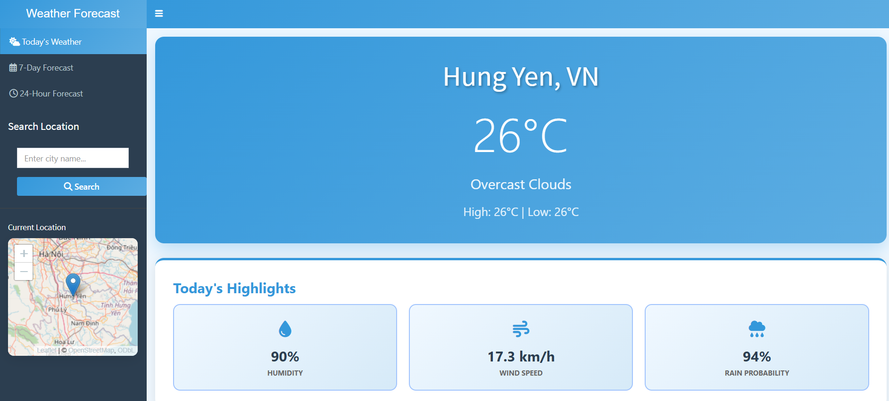
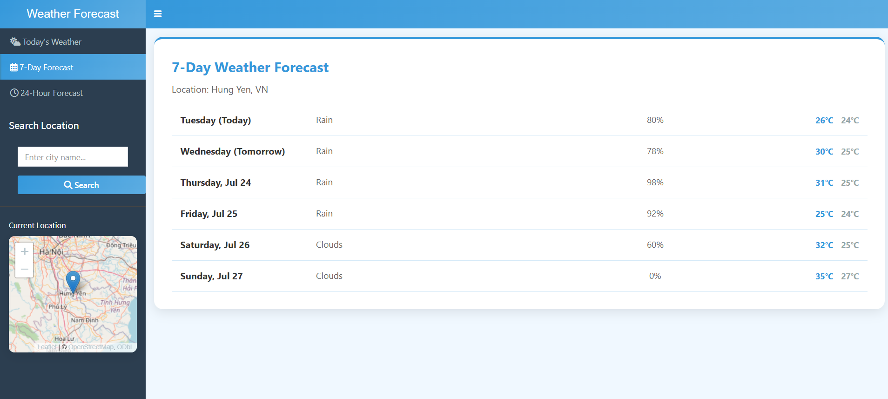
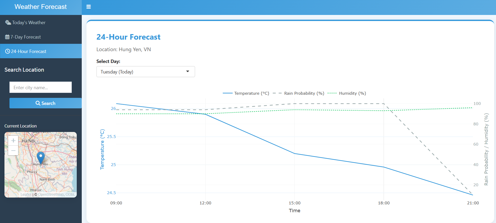

# Shiny Weather App

A minimal and interactive weather forecast dashboard built with **R Shiny**.

## Features

* 7-day forecast and 24-hour detailed view
* Interactive map (click to get weather at location)
* City search functionality
* Clean UI with tabs and hover effects
  
## How to Use

1. Clone the repo:

   ```bash
   git clone https://github.com/your-username/shiny-weather-app.git
   ```
2. Open `app.R` in RStudio.
3. Add your OpenWeather API key to this line:

   ```r
   api_key <- "YOUR_API_KEY"
   ```
4. Click **Run App**.

## Sample UI




